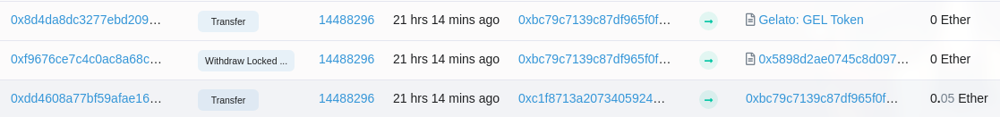

# Gelato Recovery

I created a flashbots bundle to recover $44K worth of unclaimed Gelato ICO tokens from a **compromised wallet**. This is the source code to this [Twitter thread](https://twitter.com/impranavm_/status/1512758634954240000).

### The Problem
- The **compromised wallet** has had it's private key leaked, a malicoius individual set up a bot to monitor for incoming transactions and to steal tokens as soon as they are deposited to the compromised address. 
- To claim the ICO airdrop the compromised wallet needs to be seeded with enough ETH to pay for the gas fees (without the bots stealing the ETH as soon as it is deposited). 

The solution is to send transactions to seed + claim + withdraw all in the **same block**. We can do this by sending these transactions as a bundled to the flashbot network using the [ethers-provider-flashbots-bundle](https://www.npmjs.com/package/@flashbots/ethers-provider-bundle) package.

## Transactions 
1. Send funds from `funding_wallet` to `compromised_wallet` to cover gas for claiming + transfering
2. Claim Gelato ICO tokens from `compromised_wallet` 
3. Transfer claimed Gelato tokens from `compromised_wallet` to `ledger_wallet`
4. Transfer all unused ETH from `compromised_wallet` to `funding_wallet`

## Proof Of Transactions 
The transactions can be seen bundled together in block [14488296](https://etherscan.io/txs?block=14488296&p=10)

### Transaction Hashes
| Transaction                                                            | Hash                                                                                                                                                             |
| -----------                                                            | -----------                                                                                                                                                      |
| Funding `compomised_wallet` using `funding_wallet`                     | [0xdd4608...e668d5](https://etherscan.io/tx/0xdd4608a77bf59afae165d6d9450ab03fd256d4f47a3f152928893810c5e668d5)                                                  |
 Claiming Gelato tokens to `compromised_wallet`                       | [0xf9676c...479c50](https://etherscan.io/tx/0xf76ce7c4c0ac8a68cae7417e230db2826e501a1abc731c620d8b2990479c50) |
| Withdrawing Gelato tokens from `compromised_wallet` to `ledger_wallet` | [0x8d4da8...7cb7f7](https://etherscan.io/tx/0xf9676ce7c4c0ac8a68cae7417e230db2826e501a1abc731c620d8b2990479c50) |

### Contracts/Addresses In Play
| Contract/Account Name     | Address                                                                                                               |
| -----------               | -----------                                                                                                           |
| Gelato ICO claim contract | [0x5898D2aE0745c8d09762Bac50fd9F34A2a95A563](https://etherscan.io/address/0x5898D2aE0745c8d09762Bac50fd9F34A2a95A563) |
| Gelato token contract     | [0x15b7c0c907e4C6b9AdaAaabC300C08991D6CEA05](https://etherscan.io/address/0x15b7c0c907e4C6b9AdaAaabC300C08991D6CEA05) |
| Compromised Wallet        | [0xbC79c7139C87df965F0F4C24747F326D1864C5aF](https://etherscan.io/address/0xbC79c7139C87df965F0F4C24747F326D1864C5aF) |
| Funding Wallet            | [0xc1F8713A20734059246b00d0e524F24fe9Ac7A8B](https://etherscan.io/address/0xc1F8713A20734059246b00d0e524F24fe9Ac7A8B) |
